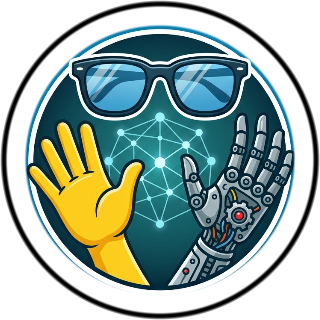
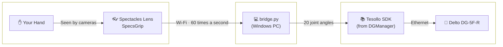
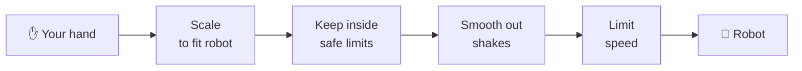

<h1 align="center">🦾 SpecsGrip</h1>

<p align="center">
  Control a <b>Tesollo Delto DG-5F robot hand</b> with your bare hands using <b>Snap Spectacles!</b><br>
  Spectacles tracks your fingers. A small program on your PC moves the robot's fingers to match - live, with no gloves or controllers.
</p>

<p align="center">
  <a href="#features">✨ Features</a> •
  <a href="#supported-devices">🦾 Hardware</a> •
  <a href="#setup">🚀 Setup & Guide</a> •
  <a href="#how-it-works">⚙️ How it works</a> •
  <a href="#troubleshooting">🛠️ Troubleshoot</a> •
  <a href="#structure">📁 Project Structure</a>
</p>

<!-- TODO: add an icon, e.g.
<p align="center">
  
</p>
-->

<!-- TODO: add the demo video (drag the file into a GitHub issue/PR box to get a user-attachments URL), e.g.
<video src="https://github.com/user-attachments/assets/..." width="300" controls></video>
-->

---

<a id="features"></a>
## ✨ Features

| Feature | Description |
| :--- | :--- |
| 🖐️ **Bare-hand control** | Bend your fingers, spread them or move your thumb, and the robot copies you. All 20 joints. |
| ⚡ **Live** | Your hand is sent 60 times a second, so the robot keeps up as you move. |
| 🔀 **Either hand** | Use your right or left hand. Auto switch follows whichever hand you're showing. |
| 🛡️ **Built-in safety** | Nothing moves until you arm it. Joints stay inside safe limits, can't move too fast, and hold still if the connection drops. |
| 🤖 **Debug panel** | Shows the connection status inside the Lens, so you can see what's wrong right on the glasses. |
| 🎛️ **Easy tuning** | All settings live in one file on your PC. Change it and restart - no need to rebuild the Lens. |
| 📦 **Nothing to install** | The PC program only needs Python. No extra packages. |

---

<a id="supported-devices"></a>
## 🦾 Supported Hardware

| Device | Type | Status | Notes |
| :--- | :--- | :--- | :--- |
| **Spectacles (2024)** | Glasses | ✅ Supported | Keep your hand in view and in good light. |
| **Specs (2026)** | Glasses | ⚠️ Need to test | — |
| **Delto DG-5F-R** (right) | Robot hand | ✅ Supported | Tested with DGSDK 2.0.0, firmware 769. |
| **Other DG-5F models** (left, S) | Robot hand | ⚠️ Need to test | Will need changes in `config.json`. |
| **Windows PC** | Runs the bridge | ✅ Supported | Tested on Windows 11. Needs Tesollo **DGManager** installed. |
| **Mac / Linux** | Runs the bridge | ❌ Not yet | The bridge uses Windows-only parts of Tesollo's software. |

---

<a id="setup"></a>
## 🚀 Setup & Guide

<details open>
<summary><b>🦾 Full Setup</b></summary>
<br>

**You need:** a DG-5F-R plugged into a Windows PC by Ethernet, Tesollo **DGManager**, **Python 3**, **Spectacles (2024)** and **Lens Studio 5.15+**.

1. **Connect the robot hand:**
   - Open **DGManager** and connect to the hand once to make sure it works. The usual settings are IP `169.254.186.72`, port `502`, **Developer** mode. If yours are different, change them in `bridge/config.json`.
   - **Close DGManager.** Only one program can talk to the hand at a time.
   - Open a terminal in the `bridge` folder and test the connection. This won't move the hand:
     ```bash
     cd path\to\SpecsGrip\bridge
     py connecttest.py
     ```
     You should see `SEQUENCE OK`.

2. **Put the PC and Spectacles on the same network:**
   - Connect **both** to the same Wi-Fi. A **phone hotspot** works best. Public Wi-Fi often stops devices from seeing each other.
   - If Windows asks *"Allow your PC to be discoverable?"*, click **Yes**. Only do this on a network you trust, like your own hotspot.
   - Open PowerShell **as admin** and run this once. It lets the Lens through your firewall:
     ```powershell
     New-NetFirewallRule -DisplayName "Delto Hand Bridge" -Direction Inbound -Protocol TCP -LocalPort 8765 -Action Allow -Profile Private
     ```
   - Run the network check. It shows the address to give the Lens, and warns you if something will block it:
     ```bash
     py netcheck.py
     ```

3. **Start the bridge:**
   ```bash
   py bridge.py
   ```
   Wait for `gripper ready`. The hand won't move until you **arm** it:

   | Key | Action |
   | :--- | :--- |
   | **`space`** | Arm / disarm |
   | **`n`** | Move the hand back to its resting pose |
   | **`q`** | Quit (the hand goes back to rest first) |

4. **Launch the Lens:**
   - Open `SpecsGrip.esproj` in Lens Studio.
   - Click the **HandBridge** object. Paste the address from `netcheck.py` into **Server Url**.
     > ⚠️ The address already saved there is the author's, so it won't work for you. You can add more than one address, split by commas. This helps when your hotspot gives your PC a new address.
   - Send the Lens to your Spectacles. After that you can close Lens Studio. No cable needed.
   - Open the Lens and check that the **Debug Panel** says **`CONNECTED`** in green. Hold up your hand, press **`space`** on the PC, and the robot follows you.

   > 💡 The Lens only connects when it runs on your Spectacles. It won't connect in Lens Studio's Preview.

5. **Settings panel:**

<!-- TODO: add a screenshot of the settings panel, e.g.

-->

- **Hand ✋ (Right / Left)**: Which of your hands controls the robot. **Right** is the default. **Left** works too - the Lens flips it so the robot still moves the right way.
- **Auto Switch Hands 🙌**: Follows whichever hand you're showing. It only switches when your current hand goes out of view.
- **Debug Panel 🤖**: Shows or hides the status panel. 🟢 Green means it's working. 🟡 Amber means it's still connecting, or it can't see your hand. 🔴 Red means it isn't connected. The last error shows at the bottom.

</details>

##

<details close>
<summary><b>🧪 Testing without Spectacles (For Developers)</b></summary>
<br>

You can test everything on your PC, without the glasses.

1. Start the bridge in test mode. It never connects to the robot. It just shows what it *would* send:
   ```bash
   py bridge.py --dry-run --auto-arm
   ```
2. In a **second terminal**, send it a fake hand that opens and closes:
   ```bash
   py test_sender.py --wave
   ```
3. To check each joint on the real robot, start `py bridge.py`, arm it, then run:
   ```bash
   py test_sender.py --sweep
   ```
   It moves **one joint at a time** and prints its name. This is the quickest way to spot a joint that moves the wrong way.

All settings are in [`bridge/config.json`](bridge/config.json). The full bridge guide is in [`bridge/README.md`](bridge/README.md).
</details>

---

<a id="how-it-works"></a>
## ⚙️ How it works

<!-- TODO: add a how-it-works video, e.g.
<video src="https://github.com/user-attachments/assets/..." width="300" controls></video>
-->

##
<details open>
<summary><b>📐 System Architecture</b></summary>
<br>



</details>

##

<details open>
<summary><b>📖 Step by Step</b></summary>
<br>

**1. Spectacles tracks your hand:** <br>

Spectacles finds 21 points on your hand: your wrist, every knuckle and every fingertip. The Lens uses them to measure three things:

- 🦴 **Curl** - how much each finger joint is bent.
- ↔️ **Spread** - how far each finger moves sideways.
- 👍 **Thumb swing** - how far your thumb moves across your palm.

> 💡 Your left hand is a mirror image of your right. Without a fix, spread and thumb swing would move the robot backwards. The Lens flips them for your left hand, so both hands work the same way.
##

**2. The Lens sends your hand to the PC:** <br>

60 times a second, the Lens sends 20 angles (4 per finger) to the bridge over Wi-Fi. The Lens only measures. All the decisions happen on the PC. That's why you can change settings without rebuilding the Lens.
##

**3. The bridge matches your hand to the robot:** <br>

The robot has 20 joints, 4 on each finger:

| Finger | Joint 1 | Joint 2 | Joint 3 | Joint 4 |
| :--- | :--- | :--- | :--- | :--- |
| **Thumb** | Spread | Thumb swing | Base curl | Tip curl |
| **Index** | Spread | Base curl | Middle curl | Tip curl |
| **Middle** | Spread | Base curl | Middle curl | Tip curl |
| **Ring** | Spread | Base curl | Middle curl | Tip curl |
| **Pinky** | Spread | Base curl | Middle curl | Tip curl |

Each of your angles is scaled to fit the robot's joint. The joint limits come from **100 poses that Tesollo ships with the robot**, so the hand can safely reach every one.

> 💡 An open, flat hand always puts the robot in its resting pose. So you always know where the robot goes when you relax your hand.
##

**4. Safety checks run on every move:** <br>



- 🔒 Nothing moves until you press `space`.
- 🧊 If the connection drops or your hand leaves view, the robot **holds still**. It won't go limp or snap back.
- 👋 When you quit, the hand slowly goes back to rest.
##

**5. The bridge talks to the robot:** <br>

The bridge uses Tesollo's own software (`DGSDK.dll`), the same one DGManager uses. It connects to the hand, presses DGManager's **Ready** button for you, then sends new joint positions 60 times a second.

</details>

---

<a id="troubleshooting"></a>
## 🛠️ Troubleshooting Guide

| Symptom | Things to try |
| :--- | :--- |
| 🧊 **Robot hand doesn't move** | The bridge starts **disarmed**. Press `space`. Also check you didn't start it with `--dry-run`. The bridge's status line tells you what's wrong. |
| 📂 **`can't open file ... bridge.py`** | Your terminal isn't in the `bridge` folder. Run `cd path\to\SpecsGrip\bridge` first. |
| 🔌 **`SOCK_EXCEPTION`** | DGManager is still open. Close it and try again. |
| ❓ **`NOT_FOUND_MODEL`** | The PC can't reach the robot hand. Check the Ethernet cable, then run `py connecttest.py`. |
| 📵 **Debug Panel says `CLOSED`** | The Lens can't reach your PC. Your PC's address may have changed. Run `py netcheck.py` and update **Server Url**. Also check that both devices are on the same Wi-Fi, and that you added the firewall rule. |
| 📶 **You're on public Wi-Fi** | Public networks often stop devices from seeing each other. Use a phone hotspot. |
| 🙈 **Won't connect in Lens Studio** | That's normal. The Lens only connects on the Spectacles. Send it to your glasses. |
| 👻 **`cannot bind` when starting the bridge** | Another bridge is already running. Close it first. |
| 🔄 **A finger moves the wrong way** | Run `py test_sender.py --sweep` to find the joint. Then swap its two `out` numbers in `bridge/config.json`. |
| 〰️ **Movement is shaky or too fast** | In `config.json`, lower `smoothing_alpha` for smoother movement, or lower `max_deg_per_sec` for slower movement. |

---

<a id="structure"></a>
## 📁 Project Structure

The repo has two halves. The **Lens Studio project** runs on your Spectacles. The **bridge** folder runs on your PC and moves the robot.

```
SpecsGrip/
├── SpecsGrip.esproj            # open this in Lens Studio
├── Assets/
│   ├── Scene.scene             # the Lens scene
│   ├── Scripts/
│   │   └── HandBridge.ts       # the main Lens script
│   ├── SettingsPanel_Frame.lspkg   # the settings panel
│   └── SpectaclesUIKit.lspkg       # Snap's buttons and panels
├── Packages/
│   └── SpectaclesInteractionKit.lspkg   # Snap's hand tracking tools
└── bridge/                     # the program that runs on your PC
```

**`Assets/` - the Lens**

| Script | What it does |
| :--- | :--- |
| 🖐️ `HandBridge.ts` | The main Lens script. Measures your hand, sends it to your PC, and runs the Debug Panel and hand settings. |
| 🎚️ `ToggleSetActive.ts` | A small helper that lets a switch show or hide something. Used by the Debug Panel switch. |

**`bridge/` - the PC side**

| File | What it does |
| :--- | :--- |
| 🧠 `bridge.py` | The main program. This is the one you run. |
| ⚙️ `config.json` | All the settings in one place. |
| 🔗 `dg5f.py` | Talks to Tesollo's software. |
| 📐 `retarget.py` | Fits your hand to the robot and runs the safety checks. |
| 🌐 `wsserver.py` | Receives your hand data from the Lens. |
| 🧪 `test_sender.py` | Sends a fake hand, for testing without Spectacles. |
| 📡 `netcheck.py` | Checks your network and prints the address for the Lens. |
| 🩺 `connecttest.py` | Tests the robot connection without moving it. |
| 🔍 `selftest.py` | Checks that Tesollo's software loads. |
| 📄 `README.md` | The full bridge guide, with every setting explained. |

##

<p align="center">
  <i>This project is open source - contributions, forks and stars welcome.</i> 🤝
</p>
